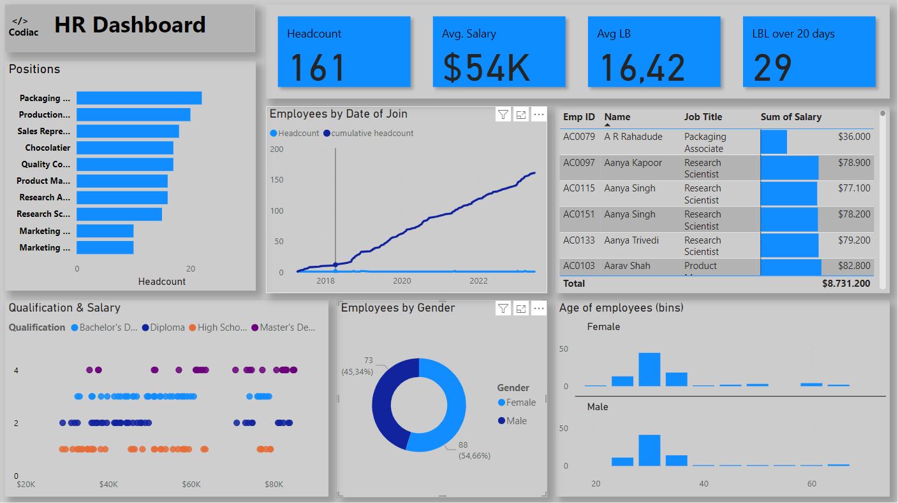

# HR Analytics Dashboard

This repository contains the Power BI dashboard for visualizing key HR metrics and trends.
The dashboard presents a comprehensive view of various HR metrics, including headcount, average salary, employee tenure, gender distribution, 
and age. The use of multiple visualizations effectively conveys different aspects of the data.

The dashboard provides insights into various aspects of the organization's workforce, including:

# Headcount & Demographics: 
Total headcount, employee distribution by position, gender, and age.
# Salary & Compensation:
Average salary, salary distribution by qualification, and employee tenure.
# Performance & Engagement: 
(If applicable) Employee performance metrics, engagement scores, and training completion rates.

# Key Features:

Interactive visualizations for easy data exploration.
Customizable filters to segment data by department, location, and other criteria.
Trend analysis to identify patterns and forecast future workforce needs.
Data-driven insights to support HR decision-making.

# Benefits:

Gain a better understanding of your workforce composition and dynamics.
Identify areas for improvement in recruitment, retention, and employee development.
Benchmark against industry standards and best practices.
Improve HR efficiency and effectiveness through data-driven insights.

# To use this dashboard:

Download and install Power BI Desktop.
Download the Power BI file from this repository.
Open the file in Power BI Desktop.
Explore the interactive visualizations and filters.
Customize the dashboard to meet your specific needs.

# Example Usage:

Analyze the impact of recent recruitment campaigns on workforce diversity.
Identify potential skill gaps and training needs within the organization.
Track employee turnover rates and identify potential retention issues.
Monitor the effectiveness of HR initiatives and programs.

# Power Bi | Data analysis | Data visualization | Dashboard 
